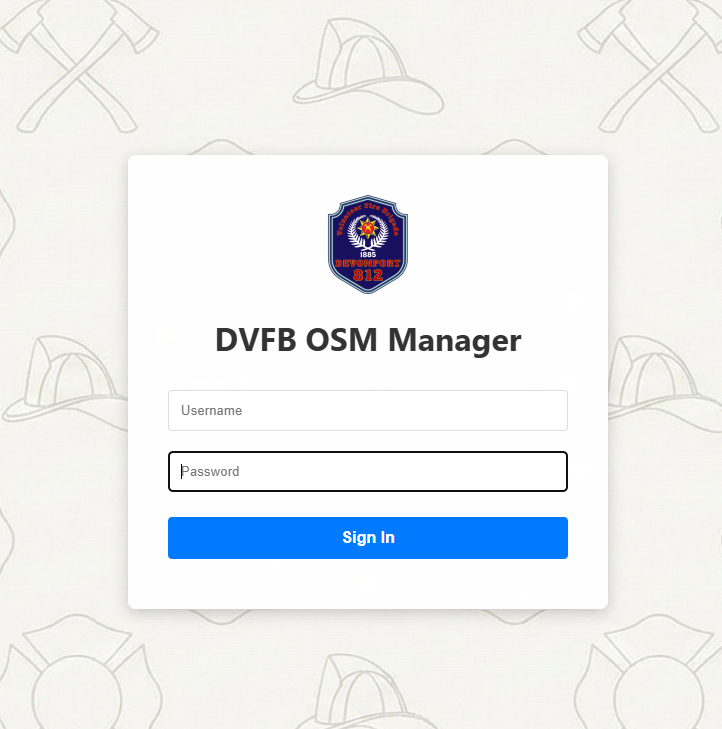
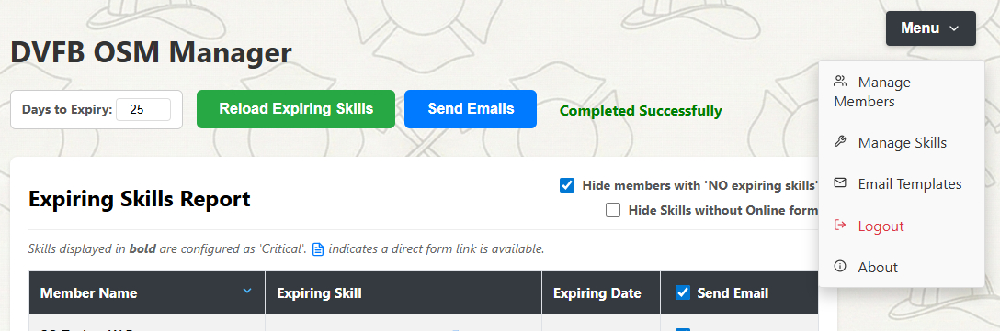
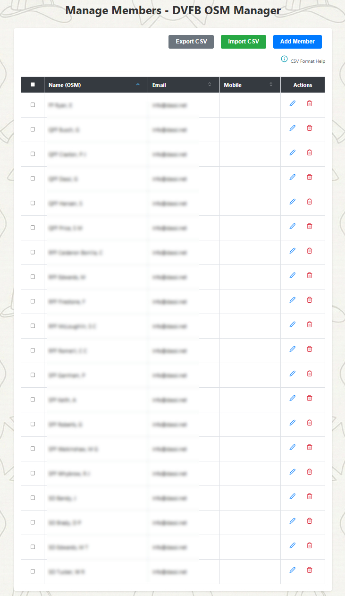
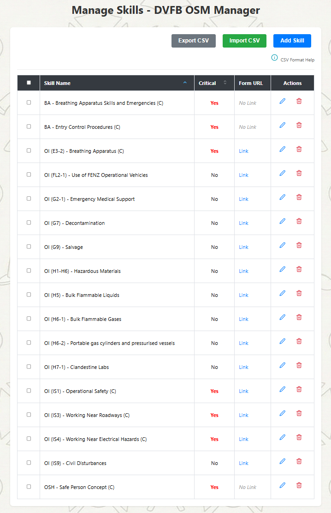
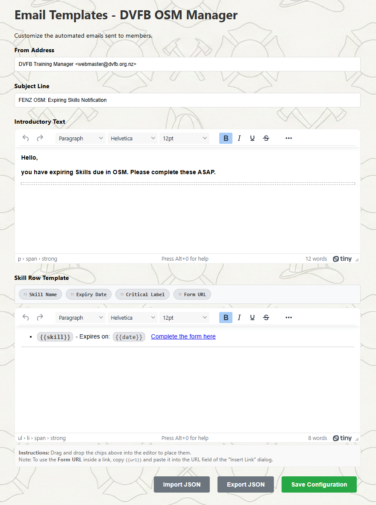
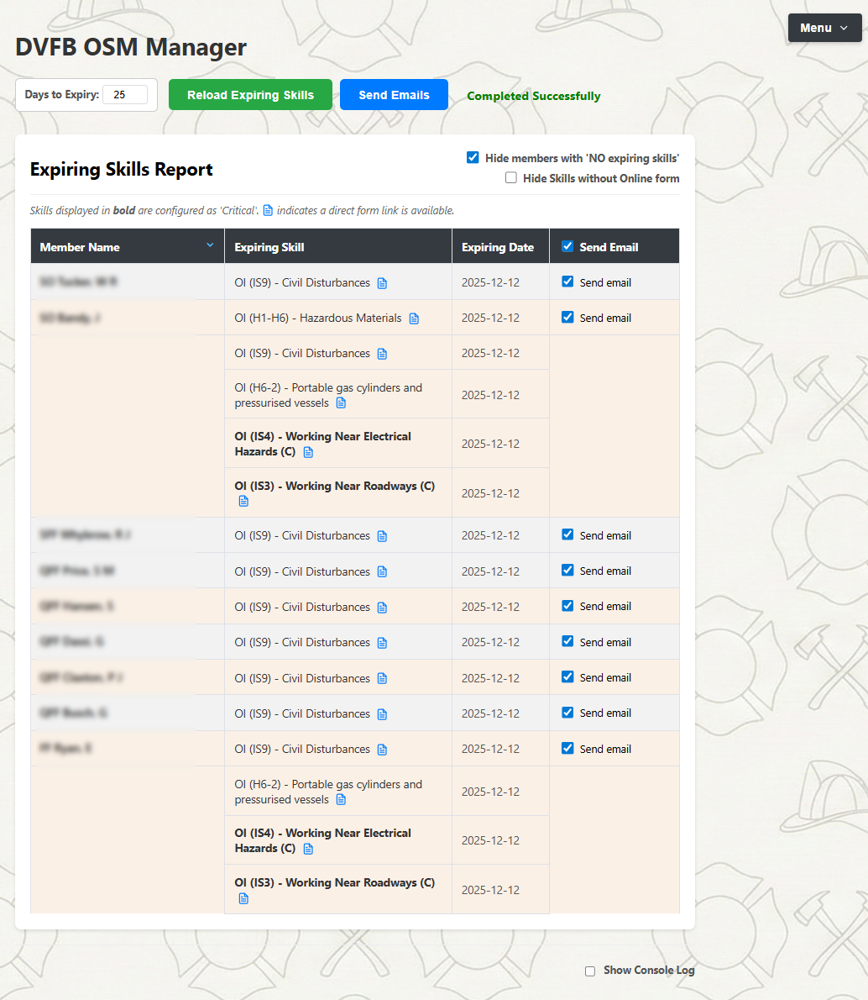

# FENZ OSM Manager

  

## Description

**FENZ OSM Manager** is a Node.js web application designed to streamline the tracking and management of expiring Operational Skills Maintenance (OSM) competencies.

It automates the process of checking a dashboard for expiring skills, persists data via a local SQLite database, and provides a secure web interface for administrators to send targeted email reminders. Unlike previous versions, this application manages all members, skills, and configurations dynamically via the web interface—no code editing required.

**Key Features:**

  * **Real-Time Web Dashboard:** A responsive UI using Socket.IO to view scraping progress, logs, and sending status in real-time.
  * **Database Driven:** All members and skills are stored in a local SQLite database (`fenz.db`).
  * **Web-Based Management:**
      * **Members:** Add, edit, delete, and CSV Import/Export members directly in the browser.
      * **Skills:** Configure which skills to track, mark them as Critical, and assign Google Form URLs.
      * **Email Templates:** A rich-text editor to customize email subjects and body content with drag-and-drop variables.
  * **Geoblocking Bypass:** Built-in proxy manager with support for **Fixed** (paid) and **Dynamic** (free) proxies to scrape New Zealand-restricted dashboards from abroad.
  * **Cloud-Native Persistence:** Uses **Litestream** to replicate the SQLite database to Google Cloud Storage, ensuring data safety even on stateless platforms like Google Cloud Run.
  * **Dockerized:** Ready for production deployment with a flexible configuration system.

## Table of Contents

  * [Prerequisites](#prerequisites)
  * [Installation](#installation)
  * [Configuration](#configuration)
  * [UI Customization](#ui-customization)
  * [Usage](#usage)
  * [Docker Deployment](#docker-deployment)
  * [Google Cloud Run Deployment](#google-cloud-run-deployment)
  * [Project Structure](#project-structure)
  * [Troubleshooting](#troubleshooting)
  * [Credits](#credits)
  * [License](#license)

## Prerequisites

  * **Node.js**: v20 or higher.
  * **npm**: Included with Node.js.
  * **Access**: Valid credentials for the OSM Dashboard you intend to scrape.

## Installation

1.  **Clone the repository:**

    ```bash
    git clone https://github.com/dassige/OSM.git
    cd OSM
    ```

2.  **Install dependencies:**

    ```bash
    npm install
    ```

3.  **Prepare Configuration Files:**
    The application uses environment variables for sensitive data. Create your `.env` file from the example template:

    ```bash
    cp .example.env .env
    ```

## Configuration

The application is configured primarily via the **`.env`** file.

### Environment Variables (`.env`)

Open the `.env` file you just created and configure the following parameters:

#### **Application Security**

  * `APP_USERNAME`: The username for the web login (e.g., `admin`).
  * `APP_PASSWORD`: A strong password for the web login.
  * `SESSION_SECRET`: A long, random string used to encrypt session cookies.

#### **OSM Dashboard Connection**

  * `DASHBOARD_URL`: **Crucial.** The full URL of the live dashboard including your unique user code.
  * `SCRAPING_INTERVAL`: Minutes to cache data before scraping the live site again (Default: `60`).

#### **Email Configuration (SMTP)**

  * `SMTP_SERVICE`: The service provider (e.g., `gmail`).
  * `SMTP_USER`: Your full email address.
  * `SMTP_PASS`: Your email password (or App Password).

#### **Proxy Configuration (Geoblocking Bypass)**

  * `PROXY_MODE`: Set to `none` (local NZ), `fixed` (paid proxy), or `dynamic` (free scraper).
  * `PROXY_URL`: Required if mode is `fixed`.

## UI Customization

You can fully customize the look and feel of the application (Logo, Background, and Login Title) to match your station's branding. This is handled differently depending on your deployment method.

### 1\. Customizing the Title

For all deployments, simply change the `UI_LOGIN_TITLE` variable in your `.env` file:

```bash
UI_LOGIN_TITLE="Station 44 OSM Manager"
```

### 2\. Customizing Images (Local / Docker)

When running locally or via Docker Compose, you can replace the default images by "mounting" a local folder containing your custom assets.

**Step 1: Create a branding folder**
Create a new folder anywhere on your computer (e.g., inside the project root). Let's call it `my-branding`.

```bash
mkdir my-branding
```

**Step 2: Add your images**
Place your custom images inside this folder. They **must** be named exactly as follows:

  * `logo.png` (The logo shown on the login screen)
  * `background.png` (The full-screen background image)

> **[Image Placeholder]:** *A screenshot of the file explorer showing the `my-branding` folder containing `logo.png` and `background.png`.*

**Step 3: Update configuration**
Open your `.env` file and set the `UI_RESOURCES_PATH` variable to point to your new folder.

  * **Relative Path:** `UI_RESOURCES_PATH=./my-branding` (Recommended if folder is in project root)
  * **Absolute Path:** `UI_RESOURCES_PATH=/Users/username/documents/osm-branding`

**Step 4: Restart**
Restart your Docker container or Node process. The application will now serve files from your custom folder instead of the default `public/resources` directory.

```bash
docker compose up -d
```

### 3\. Customizing Images (Cloud Run)

Since Cloud Run is stateless, you cannot mount a local folder. Instead, you must host your images publicly (e.g., on Google Cloud Storage, Imgur, or your station's website) and provide the URLs.

Add these variables to your Cloud Run deployment environment:

  * `UI_LOGO_URL`: `https://example.com/images/station-logo.png`
  * `UI_BACKGROUND_URL`: `https://example.com/images/station-bg.jpg`

The application will automatically download these images every time a new container starts.

## Usage

### 1\. Starting the Server

Locally, start the web server using:

```bash
node server.js
```

*The server listens on port **3000** by default.*

### 2\. Dashboard Workflow

1.  **Login**: Access `http://localhost:3000` and log in.

     

2.  **Manage Data**: Before using the dashboard, use the **Menu** (top right) to populate your database.
   
     
    
      * **Manage Members**: Import a CSV of your team or add them manually.
      


      * **Manage Skills**: Add the specific skill names (must match OSM exactly) you want to track. You can add Google Form URLs here.

      

4.  **Configure Emails**: Go to **Email Templates** to customize the message your members receive.

       

5.  **Run Dashboard**:

      * Return to the **Home** screen.
      * Click **Reload Expiring Skills** to scrape the live dashboard.
      * Select members from the list and click **Send Emails**.

    

## Docker Deployment

The project includes a `Dockerfile` and `docker-compose.yml` for easy deployment.

1.  **Build and Run:**
    ```bash
    docker compose up -d --build
    ```
2.  **Persistence:**
    The `docker-compose.yml` mounts the local directory to `/app`, ensuring your `fenz.db` (database) is preserved on your host machine even if the container restarts.

## Google Cloud Run Deployment

This application supports stateless deployment on Google Cloud Run by using Litestream for database persistence.

**How it works:**

1.  **Litestream** runs alongside the app.
2.  It continuously backs up `fenz.db` to a Google Cloud Storage Bucket.
3.  On startup, it restores the latest database from the bucket.

See [Installation on Google Cloud Run](Installation_google_run.md) for detailed deployment commands.

## Project Structure

```text
├── .env                    # Environment variables (Secrets & Config)
├── server.js               # Main Express Web Server & API entry point
├── fenz.db                 # SQLite Database (Stores members, skills, history)
├── config.js               # Configuration loader
├──VB start.sh              # Startup Script (Litestream Restore & Init)
├── public/                 # Frontend Assets
│   ├── index.html          # Main Dashboard
│   ├── members.html        # Member Management UI
│   ├── skills.html         # Skill Management UI
│   ├── email-templates.html # Email Editor UI
│   └── app.js              # Frontend Logic (Socket.IO client)
├── services/               # Backend Logic
│   ├── db.js               # SQLite Database Adapter
│   ├── mailer.js           # SMTP Service
│   ├── scraper.js          # OSM Dashboard Scraper
│   └── proxy-manager.js    # Proxy Logic
└── Dockerfile              # Container definition
```

## Troubleshooting

  * **"Unauthorized" Socket Error:** Ensure you have logged in via the login page; direct API access is blocked.
  * **Scraper returns 0 results:**
      * Check your `DASHBOARD_URL`.
      * If outside NZ, ensure `PROXY_MODE` is set correctly. Check the web console for "Proxy verification" logs.
  * **Database Locked:** SQLite allows only one writer at a time. Ensure you don't have the `fenz.db` file open in a viewer while the app is writing.

## Credits

  * **Project Lead & Developer:** Gerardo Dassi
  * **Litestream:** Used for SQLite replication in serverless environments.
  * **Icons:** Provided by [Feather Icons](https://feathericons.com/).

## License

This project is licensed under the **MIT License**.

```text
MIT License

Copyright (c) 2025 Gerardo Dassi

Permission is hereby granted, free of charge, to any person obtaining a copy
of this software and associated documentation files (the "Software"), to deal
in the Software without restriction, including without limitation the rights
to use, copy, modify, merge, publish, distribute, sublicense, and/or sell
copies of the Software, and to permit persons to whom the Software is
furnished to do so, subject to the following conditions:

The above copyright notice and this permission notice shall be included in all
copies or substantial portions of the Software.

THE SOFTWARE IS PROVIDED "AS IS", WITHOUT WARRANTY OF ANY KIND, EXPRESS OR
IMPLIED, INCLUDING BUT NOT LIMITED TO THE WARRANTIES OF MERCHANTABILITY,
FITNESS FOR A PARTICULAR PURPOSE AND NONINFRINGEMENT. IN NO EVENT SHALL THE
AUTHORS OR COPYRIGHT HOLDERS BE LIABLE FOR ANY CLAIM, DAMAGES OR OTHER
LIABILITY, WHETHER IN AN ACTION OF CONTRACT, TORT OR OTHERWISE, ARISING FROM,
OUT OF OR IN CONNECTION WITH THE SOFTWARE OR THE USE OR OTHER DEALINGS IN THE
SOFTWARE.
```
